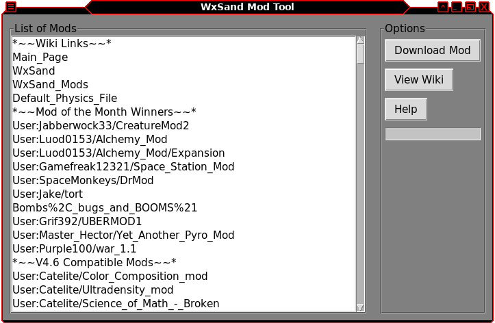

# wxSand Mod Tool

Wxsand is Owen Piette, or "Opiette"'s C++ variant of the original Falling Sand Game. First made in early 2006, it was later expanded by purple100 to have a 255 element limit for additional mod support. The game is currently abandonware, but there there have been other attempts to revive and archive the game.

ctrlcctrlv was able to successfully compile the game to Linux, and has a repository with most of the mods. You can find that project [here](https://github.com/ctrlcctrlv/wxsand/tree/master?tab=readme-ov-file#wxsand---owen-piettes-falling-sand-game).

This wxSand Mod Tool is a Python application with a graphical user interface (GUI) designed to simplify the process of downloading mods and accessing archived wiki pages for wxSand, Owen Piette's Falling Sand Game. The format and order the mods appear on the list is almost indentical to the way they would have orginally appeared within 'Load Physics from Online Wiki' option within wxSand before the FSG Wiki servers shut down.

Please note that not all mods are tested, and some mods are only compatible with specific versions of the game.

## Features

- **Mod Downloading**: Easily download mods directly from the tool's interface, streamlining the process of adding new content to wxSand.
- **Wiki Page Access**: Seamlessly access archived wiki pages for mods hosted on the FSG wiki archive, allowing users to retrieve valuable information and documentation about each mod. Please note all mods may not have documentation on the wiki entries.

## Getting Started

To use the wxSand Mods Tool, follow these steps:

1. **Clone the Repository**: Clone this repository to your local machine.
2. **Install Dependencies**: Make sure you have Python installed on your system. Additionally, install the required Python libraries. (`requests` `beautifulsoup4` `tk`)
3. **Run the Script**: Execute the Python script.
4. **Use the GUI**: Once the GUI launches, you can navigate through the options to download mods or access archived wiki pages for mods.

## Contributions

Contributions to the wxSand Mods Tool are welcome! If you encounter any issues or have suggestions for improvements, please open an issue or submit a pull request.
